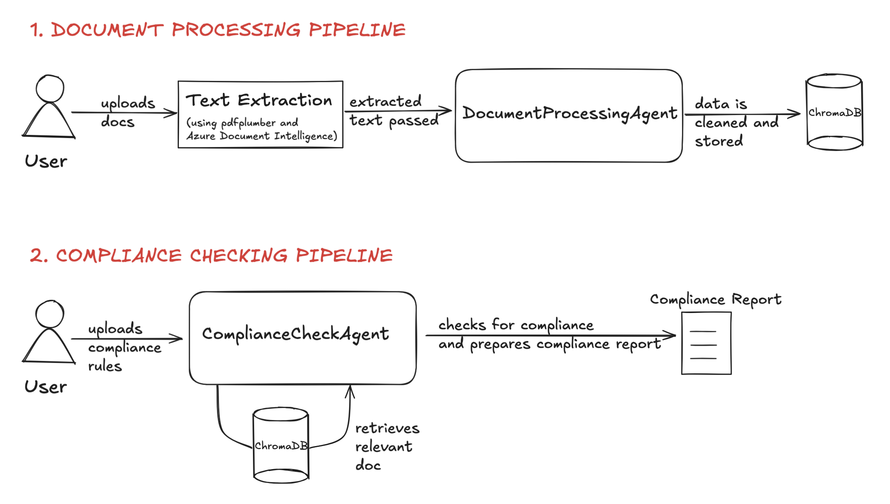
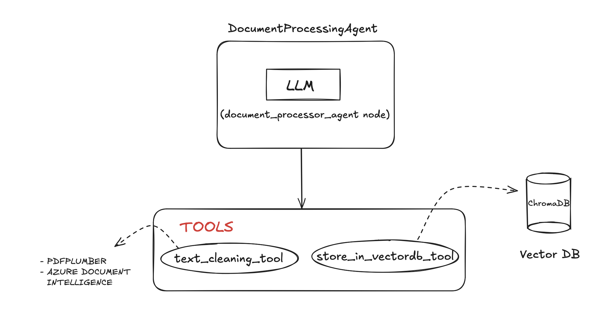
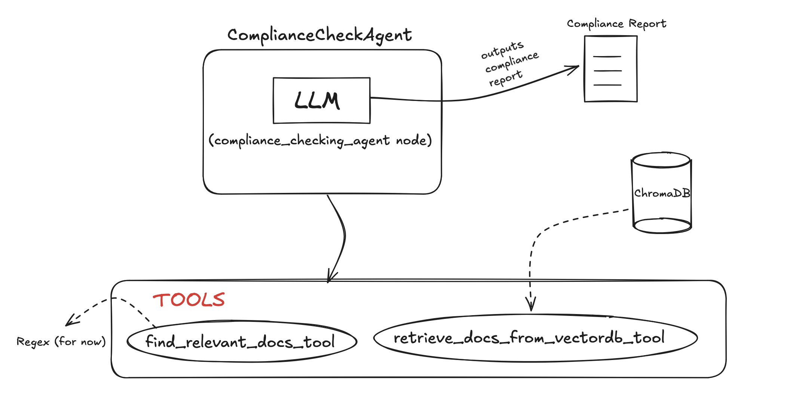

# 📄 Document Compliance Agent

A multi-agent AI application that takes in documents, processes them, and checks for compliance against user-defined rules. Made using LangGraph for the agents and Streamlit for the UI – Made by **Syed Haroon Shoaib**

---

## 🚀 First Option: Use this link to open the app

👉 **I have deployed my Streamlit app using Render:**

🔗 https://document-compliance-ai-agent.onrender.com

This doesn't require setting API keys or endpoints since those are handled on my Render dashboard.

---

## ⚙️ Second Option: Run locally

### 1. Clone the Repository

```bash
git clone https://github.com/h-shoaib/document-compliance-ai-agent.git
cd document-compliance-ai-agent
```

### 2. Create and Activate Virtual Environment

#### 🖥 macOS / Linux:

```bash
python3 -m venv dcaa-venv
source dcaa-venv/bin/activate
```

#### 🪟 Windows (CMD):

```cmd
python -m venv dcaa-venv
dcaa-venv\Scripts\activate
```

#### 🪟 Windows (PowerShell):

```powershell
python -m venv dcaa-venv
.\dcaa-venv\Scripts\Activate.ps1
```

### 3. Create a `.env` file 

Create a file named `.env` and add the following variables:

```env
AZURE_DOCUMENT_INTELLIGENCE_ENDPOINT= "your_azure_endpoint_here"
AZURE_DOCUMENT_INTELLIGENCE_KEY= "your_azure_key_here"
OPENAI_API_KEY= "your_openai_key_here"
```

### 4. Install Dependencies

```bash
pip install -r requirements.txt
```

### 5. Run the App

```bash
streamlit run streamlit_app.py
```

---

## 🧠 Architecture

### Application Pipeline



#### --> Document Processing
1. User uploads files.
2. Text is extracted using `pdfplumber` and `Azure Document Intelligence OCR`.
3. Text is passed to **DocumentProcessingAgent** to clean and store in ChromaDB.

#### --> Compliance Checking
1. User inputs compliance rules.
2. Rules go to **ComplianceCheckAgent**, which retrieves relevant docs and checks compliance.
3. A final report is generated and displayed.

### Agents

The program uses 2 LangGraph agents – the DocumentProcessingAgent and the ComplianceCheckAgent.

### 1. DocumentProcessingAgent



- Takes the extracted text, cleans it, and stores it.
- **Node**: `document_processing_agent` (powered by OpenAI's GPT-4.1)
- **Tools**:
  - `text_cleaning_tool`: Uses LLM to clean raw data.
  - `store_in_vectordb_tool`: Stores cleaned text in ChromaDB.

### 2. ComplianceCheckAgent



- Takes compliance rules, retrieves relevant docs from the DB, and prepares a report.
- **Node**: `compliance_checking_agent` (also powered by GPT-4.1)
- **Tools**:
  - `find_relevant_docs_tool`: Regex-based tool to extract document names from rules.
  - `retrieve_docs_from_vectordb_tool`: Fetches document text from ChromaDB.

---

## 📘 Description

The Document Compliance Agent is designed to:
- Process PDF and image documents to extract text.
- Store extracted content in a vector database.
- Check documents against user-defined compliance rules.
- Provide a clear, consolidated compliance report in pdf or csv format.

The application supports multiple file uploads, AI-powered processing, and an interactive Streamlit interface for compliance verification and reporting.

Remember to switch tabs to the compliance checker after processing the documents.

### Reasoning for various choices

- Langgraph was used because it's heavily customizable and allows great control over the agent. Tool calling and binding is easily handled, states can be easily customized, and it has a constantly improving library of features.
- pdfplumber used because some pdfs have directly embedded text so it saves the cost of an api call to Azure's OCR
- Azure Document Intelligence was used because of it's high accuracy of extraction and generous free tier
- ChromaDB is used because it's a lightweight vector database and easy to use, hence is perfect for this demo.
- The separation of the two pipelines is to reduce complexity in coding, and make it easy to prepare a user friendly UI

## 🧩 Assumptions, Limitations & Future Work

**Assumptions:**

* Users will upload PDFs or images of reasonable size with recognizable text.
* Compliance rules mention the exact filename with the extension (like .pdf or .png) since the extensions are used for the Regex functions

**Limitations:**

* The app currently supports English documents only.
* Too large files are unable to be handled since the Azure OCR api has a file size limit
* 

**Future Improvements:**

* A true CAG can be implemented in the future for improved accuracy, possibly with the help of a locally hosted LLM and a custom written caching function. 
* Add support for multi-language OCR and compliance rules.
* Introduce human-in-the-loop corrections (for example if the agent is confused about a particular rule or about which file, it can ask for clarification
* Improve UI (this demo uses just streamlit which while convenient has it's limitations. Maybe in the future it can be remade with a React frontend

---
